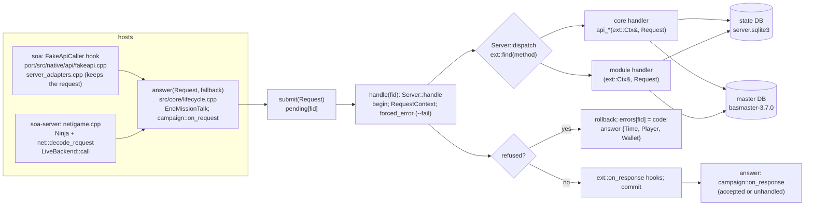

# Local server: architecture

How a request becomes a reply, what owns which part, and where state and master data live. This describes the code **as it is today** (the layout of `server/README.md`); `server/PLAN-readability.md` section 2 is the target, and each of its steps updates this file. To find a given API or rule, use [API-INDEX.md](API-INDEX.md) (generated). The rules themselves, with their source labels, are in [docs/server-rules.md](../docs/server-rules.md).

## The pieces

| Piece | Where | Owns |
|---|---|---|
| The library (`libsoaserver`) | `src/`, `include/soaserver/` | the request lifecycle, the state DB, the master lookups, every game rule, the CDN content |
| The core | `src/core/server.cpp`: `struct Server` | the two DB handles, the gacha pools, the RNG, the pending requests and their error codes, the transaction and refusal path, `Server::dispatch` (the registry's handler of the method). `src/core/context.cpp` defines `ext::Ctx`'s services, `src/core/clock.cpp` the server clock and the event calendar. Its shared helpers beside it in `src/core/` (`time`, `errors.h`, `response`, `wallet`, `rewards`, `request_args.h`, `request_context.h`, `assets`, `ids.h`), `src/state/` (the state module: the schema and its migrations, the meta helpers, the master-reference check, the one SQLite wrapper, the Game.xml codec, seeding) and `src/master/master` |
| The core's APIs | `src/api/entry/`, `src/api/player/`, `src/api/missions/`, `src/api/gacha/`, `src/api/presents/`, `src/api/favor/favor_api.cpp` | 37 methods: the entry flow (8); the player load and the parties (6, with the player state builders); the missions (8); the gacha (10); the present box (3); the favor APIs (2). Registered first, with `ext::add_core_api` |
| The modules | `src/api/<domain>/` | 69 more methods, and hooks into the core's responses, registered through `include/soaserver/ext.h` in `src/core/modules.cpp`'s order |
| The story campaign | `src/api/campaign/` (`campaign.cpp` the hooks and the splice; `master_data.cpp`, `progress.cpp`, `lists.cpp`), `soaserver/api_campaign.h` | the campaign's own progress (a text file, below); called around each request by `server::answer` (`src/core/lifecycle.cpp`), not by the dispatcher |
| Host 1: soa (in-process) | `port/src/native/api/` (not in `server/`) | the FakeApiCaller hooks: the guest's arguments -> `Request`, the reply -> the client's `On<Api>Res` |
| Host 2: soa-server (out of process) | `net/`, `app/main.cpp` | the wire protocol: TCP packets, the Ninja cipher, the bridge handshake, the request decoder, the HTTP server and CDN routes |

## How a request flows



The same in text, with the functions to look up:

```
 soa (in-process)                                   soa-server (out of process)
 FakeApiCaller hook (port/src/native/api)           net/loop.cpp poll loop -> net/game.cpp GameServer::handle_packet
   server_adapters.cpp: guest registers -> Request    Ninja decrypt -> net/wire.cpp decode_request -> Request
   kept (server_port::remember) until Progress        LiveBackend::call (net/game.cpp)
   fakeapi.cpp ServeProgress: answer(r, the file)     answer(r, {data: {Time}})
   refused: ErrorHandler::Handle; else the On*Res     reply: <Name>Res, AES; Login: LoginResult + GetPlayerRes
             \                                         /
              v                                       v
   answer()   (src/core/lifecycle.cpp)            (one global Server, one mutex)
              -> EndMissionTalk: end_mission_talk(mission) (events, else the campaign), then GetPlayMission's answer
              -> submit(): pending[fid] = Request; campaign::on_request(r)
              -> handle(fid): Server::handle: a RequestContext for the request (its battle log); ext::Ctx = Server::make_ctx
                   -> Server::handle_request: "begin"; forced_error (--fail / SOA_SERVER_FAIL)
                   -> Server::dispatch: ext::find(method) (37 core methods, 69 module methods)
                        core handler and module handler alike: (ext::Ctx&, const Request&) -> body
                   -> RequestContext::refusal != 0: "rollback", errors[fid] = code, body = {Time, Player, Wallet}
                   -> else ext::on_response hooks (decode, add keys, re-encode), "commit"
              -> not handled: the host's fallback body; accepted or not handled: campaign::on_response
              -> Reply {body, error_code, handled}
```

- **One request lifecycle for both hosts** (`server::answer`, step R9 of the plan): the story campaign's `on_request` / `on_response` and `EndMissionTalk` are the library's. The hosts only capture the request and deliver the reply. soa's FakeApiCaller has no EndMissionTalk entry to answer: its hook calls `server::end_mission_talk` and queues a GetPlayMission request instead (`fakeapi.cpp h_end_mission_talk`).
- `handle(fid, out)` lost the `file` parameter (the FakeApiCaller's canned file name, read by nothing); the old signature is a wrapper for one merge wave.
- The replay harness (`soa-server --replay`, `server/app/replay.cpp`) drives exactly the soa-server path (`net::live_backend()`), so it is the reference for "what the server answers" (`server/tests/replay/README.md`).

## Transactions, refusals and errors

- **Opening the state.** `Server::open_state` (both hosts, the scratch servers) brings the file to this build's schema (`state::open_and_migrate`: each migration step in its own transaction, `foreign_key_check` before its commit), switches foreign keys on, seeds a state without a player in one transaction, and logs the references into the master that don't resolve (`state::report_master_refs`, report-only).
- **One transaction per request.** `Server::handle_request` opens it before dispatching and commits it after the response hooks; a response and the state it reports are written together. A commit the DB refuses (a deferred foreign key a request violated) is rolled back and answered as a refusal (10208).
- **A refusal** (`ext::refuse(ctx, method, why, code)` or its printf-style `ext::refusef` in any handler, core or module, or `--fail Method:code`) rolls the transaction back, records `errors[fid] = code`, logs `fid … (Method): refused with error N` (scripts read this line) and answers only the player state `{Time, Player, Wallet}`. `error_code(fid)` reports the code: soa's FakeApiCaller hooks answer the client's `IsSuccess` / `ErrorCode` with it; soa-server sends a ProtocolError with the code as its status. The client then shows `master_text error_message_text_<code>`. The codes in use are named in `src/core/errors.h` (`ErrorCode`, generated from the client's texts by `tools/gen_error_codes.py`; `ext.h` "refuse" lists them too).
- **Not handled** (no handler, or a handler that returns an empty body): `handle` returns false. soa then answers the file of its fake-server directory (`SOA_FAKE_SERVER`), or `{}` when there is none; soa-server answers `{data: {Time}}`. Both add the campaign's data.
- Handlers don't throw.

## One handler shape

Every handler, the core's and the modules', is `std::vector<u8> handler(ext::Ctx& ctx, const Request& r)` (`ext::Handler`); an empty body means "not handled".

- **`ext::Ctx`** (`include/soaserver/ext.h`): the state DB `st` (inside the request's transaction), the master DB `m`, the RNG, the request's `RequestContext` (`ctx.request`) and the gacha pools, plus the server's services as member functions (`now`, `event_now`, `base_data`, `roster`, `stock`, `items`, `grant`, `core_mission`, `set_error`, ...; defined in `src/core/context.cpp`, so "go to definition" lands on the code). `Server::make_ctx` makes one per request. Tests set `ctx.test` (fixed clocks, a refusal observer); a live server never does.
- **`RequestContext`** (`src/core/request_context.h`): what belongs to one request and nothing else: its refusal code, its battle log, whether the server is live (the client's data is there; false in the unit tests' scratch servers, which use `test_log_value`), whether Login answered the player (the server's `logged_in()`), the titles the request granted. `Server::handle` makes a fresh one per request, so nothing of a request stays on the server object or in a global.
- **The core mission for a module** (`ctx.core_mission(r, override)`): a direct call of the core's `start_mission(ctx, r, override, restarting)` (`src/api/missions/`) / MissionEnd / MissionFailed with the module's changes as an explicit argument; MissionRestart is the same call with `restarting = true`.

## Clocks

Two clocks, both in `include/soaserver/server.h` (defined in `src/core/clock.cpp`):

- **`clock_now()`, the server clock**: the real time, or `--clock "YYYY-MM-DD HH:MM:SS"` (soa: `SOA_CLOCK`) running on from there. Stamina, login days, wallets, rentals and every `*_at` the server stores use it.
- **`event_now()`, the event calendar**: for dated content (event terms, deep-space missions, the Sphere 211 season). With `--clock` it is the clock; without, today's month-day and time mapped onto the most recent year in which some `master_event_term` covers that day (`src/core/clock.cpp`; docs/server-rules.md "Clocks"), so the service's calendar replays year after year.
- **Formats**: every time the server sends or reads is local `YYYY-MM-DD HH:MM:SS`; `src/core/time.h` has the one formatter (`format_time`), the parsers, the reset day (`day_start`, at master_global `login_bonus_reset_hour`) and the opened_at..closed_at window (`open_at`).
- **Test seam**: `set_clock_source(fn)` replaces the wall-clock read under `clock_now()` (`time(nullptr)` by default); the replay sets it to each recorded request's time. `set_server_clock(t)` is the tests' `--clock`.

## The module registry and its order

`include/soaserver/ext.h` is the module API. Each module has one function, `register_<module>()` (declared in `src/core/modules.h`, defined at the end of the module's file), that registers its handlers and hooks with the `ext::add_*` functions:

| Kind | Registered with | What it does | Count today |
|---|---|---|---|
| Api | `ext::add_core_api({"Method", ...}, fn)` (the core's, first) / `ext::add_api` (a module's) | answers its methods | core: 29 registrations, 37 methods; modules: 57 registrations, 69 methods |
| `OnPlayerLoad` | `ext::add_player_load(fn)` | adds keys to the full player state (Login, SimpleLogin, CreatePlayer, GetPlayer, NoLoginStart) | 14 |
| `OnResponse` | `ext::add_response_hook(fn)` | sees and may add keys to every answered response | 2 |
| `MissionStartExtra` / `MissionResultExtra` | `ext::add_mission_start_extra` / `add_mission_result_extra` | adds to MissionStart / MissionEnd after the core built them | 2 / 3 |
| `Grant` | `ext::add_grant(type, fn)` | grants a content type the core's `grant()` doesn't handle | 5 |
| `ItemExtra` | `ext::add_item_extra(fn)` | adds keys to each owned item in `Item` | 1 |
| `ClientMaster` | `ext::add_client_master(fn)` | changes the master DB the CDN serves to the client | 5 |
| `AreaExtra` | `events::add_area_extra(fn)` | adds keys to each area of the event area list | 1 |

**The order is one explicit list.** `src/core/modules.cpp` calls the register functions in one list, the core's APIs (`entry`, `player`, ..., `favor`) first, then the modules (`modules::register_all`), once, the first time anything reads the registry (`ext::find`, `ext::player_load`, `ext::client_master`, ...), so neither host calls it. Each kind runs in registration order. `OnPlayerLoad` and `OnResponse` hooks add keys to one response map, and maps keep insertion order on the wire, so this order is visible in the reply bytes; it no longer depends on the source files' names (before step R4 of the plan it was the static-initializer order, i.e. the files sorted by name), so a file can be renamed or moved without changing a reply. The list is today's former order. The test `server/module-order` (`src/core/modules_tests.cpp`) pins it per kind: changing the order is a change to the replies and must update that list in the same commit. `soa-server --list-hooks` prints every hook in its run order (kind, module, file:line, detail), and API-INDEX.md section 2 is generated from it.

**Duplicates are errors.** A method registered twice (a module can't take over a core method: the core registers first) or a content type granted twice is a registration error: logged, the first registration kept, `ext::registration_errors()` non-empty. soa-server refuses to start with one; the test `server/module-order` fails on one (in both soa-server's and soa's selftests).

`soa-server --list-apis` prints every method with the file that registers its handler (or `-`); `--list-hooks` the hooks in their run order.

## Where state and master data live

| Data | Where | Who writes it |
|---|---|---|
| The player state | SQLite: `--db` (soa: `SOA_SERVER_DB`), else soa-server's `--data DIR/server.sqlite3`, else `server.sqlite3` in the working directory | the handlers, core and modules alike; every table (58) is created when the file opens, by `src/state/schema.cpp`'s migration steps (`pragma user_version`; an older file is upgraded after a `.bak-v<N>` copy, a newer one refused; `src/state/README.md`). `server/PLAN-schema.md` section 1 is their inventory |
| The story campaign's progress | `<data_root>/server_campaign.txt` (a text file: cleared missions, the last one) | `src/api/campaign/progress.cpp` only; outside the state DB (PLAN-readability section 6) |
| The master data | `data/basmaster-3.7.0.sqlite3` (read-only; `--master`) | nobody: the server reads it |
| The client's master copy | the CDN's `basmaster-served.sqlite3` (`<scratch>`), the 3.7.0 master with `apply_client_master` | `cdn::Tree::build` (`src/cdn/tree.cpp`), `make_served_master` (`src/cdn/served_master.cpp`) |
| Gacha pools | `data/gacha_pools.sqlite3` (reconstructed; read-only) | `tools/build_gacha_pools.py` |
| The seed | `data/saves/seed/Game.xml` (sanitized, `LOCAL00001`; `--seed`) | read once when the state DB is new |

## What each host owns

- **soa** (`port/src/native/api/`): capturing the guest's arguments into a `Request` (`server_adapters.cpp`), delivering the reply to the client's `On<Api>Res`, the asset index (`AssetIndex` from the AssetManager), its in-process CDN (`server_cdn.cpp`), the `ErrorCode` / `IsSuccess` answers.
- **soa-server** (`net/`, `app/`): the TCP and HTTP servers, the bridge, sessions and keys, decoding requests (`net/wire.cpp`, the generated layout table `net/gen/wire_decode.inc`), encrypting replies, LoginResult's extra `Player` map and the GetPlayerRes after it, `wire_device`, and the CDN routes (`net/cdn_http.cpp`).
- **The library**: everything between `Request` and the reply body.

## Tests and proofs

- `soa-server --selftest [FILTER] [--shuffle N]`: the library's and the wire layer's unit tests (scratch servers, no game). `--shuffle N` runs them in a shuffled order.
- `soa --selftest "server/"`: the server tests that need the game (`port/src/native/api/zz_server_guest_test.cpp`).
- `tools/server_replay_diff.sh PARENT CHILD`: replays the corpora of `server/tests/replay/` with two builds and compares replies, error codes, end state and the log (RG4).
- `tools/server_evidence.py --against REV`: no rule label, client address, symbol, offset, master table or log-line pattern lost (RG10's evidence check).
- `tests/diff/run.sh`: the port against the emulator, three flows.
- `tools/schema_inventory.py --lint`: every INSERT names its columns and no future FK parent is written with INSERT OR REPLACE (PLAN-schema S0); `server/schema-integrity` checks the state's references into the master (`state::check`, `src/state/check.h`).
- The schema's migrations: `server/schema-fresh-equals-migrated`, `server/schema-migrate-v1` (on the committed v0 fixture `tests/fixtures/state-v0.sql`, `tools/make_state_fixture.py`), `server/schema-newer-refused` (`src/state/schema_tests.cpp`).
